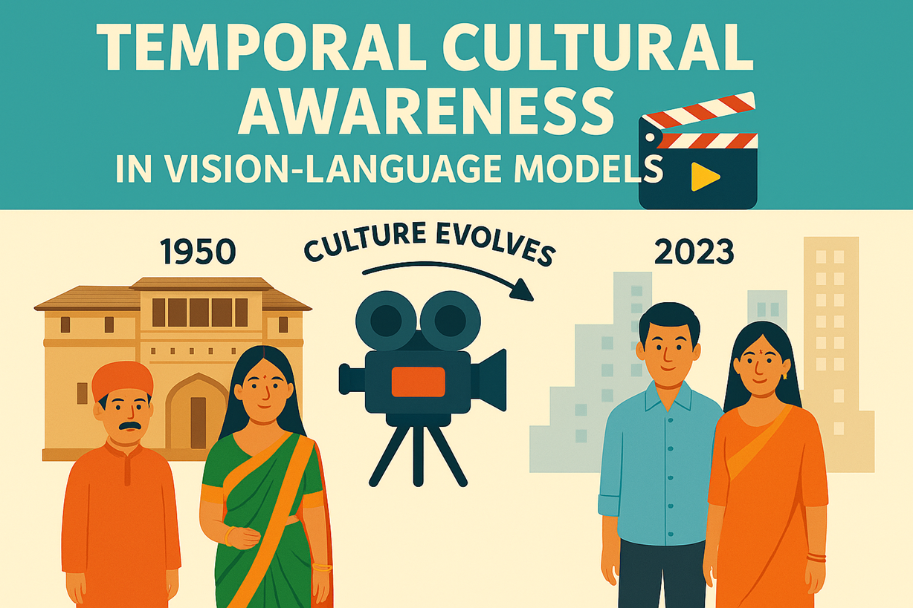

## Motivation

As Vision-Language Models (VLMs) become increasingly integrated into global applications, their ability to understand and adapt to diverse cultural contexts is more critical than ever. However, most current benchmarks treat culture as a static entity, overlooking how norms, aesthetics, and values evolve over time. This static approach risks perpetuating outdated stereotypes and marginalizing underrepresented communities. To address this, we introduce the **CineCulture Dataset** —a collection of annotated movie screenshots spanning decades and geographies—to systematically evaluate and improve the temporal cultural awareness of AI systems. By leveraging cinema’s rich, time-aligned record of societal change, CineCulture enables the study of how well AI models capture both the diversity and the evolution of cultural signals, helping to build fairer and more globally competent technologies.

## Call for Contribution

We invite the community to join us in curating and expanding the CineCulture Dataset! This initiative is open to all, and your contributions will directly shape a high-quality, temporally diverse benchmark of cultural representation in cinema. 

**Contribution Timeline:**
- **Adding new datasets:** 15th June 2025 – 1st August 2025
- **Running models & gathering insights:** 1st August 2025 – 20th August 2025
- **Paper writing:** 20th August 2025 – ICLR 2026 deadline

This is your chance to become a co-author of our upcoming ICLR submission. We aim to curate a benchmark covering cultures from various demographic regions, with all data usage strictly for academic purposes. **Copyright for all images remains with their respective holders; our use is solely to test temporal understanding in VLMs.**

## How You Can Contribute

We have identified four main ways to help build the CineCulture Benchmark:

1. 📸 **Image Collection:** Contribute movie snapshots depicting culturally relevant items, along with metadata about copyright, movie source, temporal context, demographic region, and people involved.
2. 📝 **Annotation:** Annotate images for the presence of culturally relevant items and their associated values.
3. ✔️ **Quality Checking:** Validate the accuracy and quality of image-annotation pairs.
4. 👥 **Human Evaluation:** Assess LLM-generated images for cultural relevance, using the same criteria as above.

Our goal is to curate at least **250 validated image-annotation pairs per demographic region** for inclusion in the benchmark.

## Authorship

We follow a point-based system inspired by the [SeaCrowd Project](https://github.com/SEACrowd#contributing-to-seacrowd) to determine co-authorship. To be considered a co-author, you must earn **at least 15 contribution points** (equivalent to contributing or annotating at least 15 images). The order of authorship will be determined by total points, with higher contributors listed first.

Track your points via our [contribution sheet](points.md) and update your score with each PR. Past contributions also count. All qualifying contributors will also be added to the TemporalCultureShift GitHub and Huggingface repositories.

> **Note:** The point system is designed to reward, not restrict, collaboration. We may lower the threshold to include more co-authors if needed.

### Contribution Point Guideline

| Contribution Type             | Demand        | Points | Description                                                                                   |
|-------------------------------|--------------|--------|-----------------------------------------------------------------------------------------------|
| Image Collection              | Medium       | 1      | Submit a culturally relevant movie snapshot with required metadata.                            |
| Annotation                    | Medium       | 1      | Annotate an image for presence and values of cultural items.                                   |
| Quality Checking/Validation   | Low          | 0.5    | Review and validate an image-annotation pair.                                                  |
| Human Evaluation (LLM Output) | Medium       | 1      | Evaluate a generated image for cultural relevance and accuracy.                                |

**Authorship threshold:** 15 points (e.g., contributing or annotating 15 images).

## Communication Channels

All communication will happen through this GitHub repository. Please open issues or discussions for questions, and `Watch` the repository to stay updated on changes and announcements.

## Current Maintainers

The project is currently maintained by [Gautam Jajoo](https://gautamjajoo.github.io/), [Harsh Deshpande](https://harshsdeshpande.github.io/), [Hamna](https://github.com/HamAbid), [Pranjal Chitale](https://github.com/PranjalChitale), [Varun Gumma](https://varungumma.github.io/)

---
